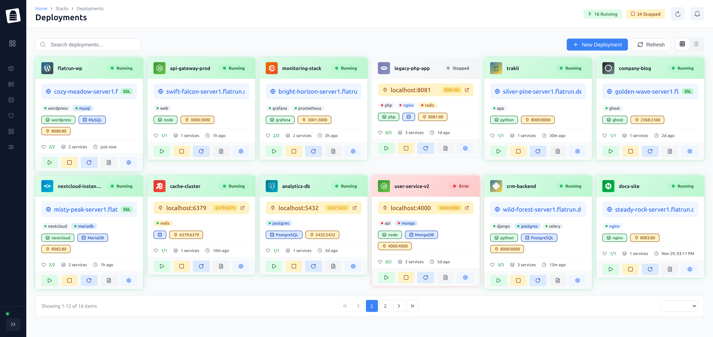

# FlatRun UI

Modern Vue 3 web interface for FlatRun container orchestration.



## Overview

FlatRun UI provides a user-friendly dashboard for managing Docker deployments through the FlatRun Agent. It offers real-time monitoring, container management, and a streamlined deployment workflow.

## Features

- **Deployment Management** - Create, start, stop, and delete Docker Compose deployments
- **Container Monitoring** - Real-time status, resource usage, and health checks
- **Log Viewer** - Live streaming logs with search and filtering
- **Docker Resource Management** - Images, volumes, and networks overview
- **SSL Certificate Tracking** - Monitor certificate expiration and status
- **Quick App Templates** - Deploy common applications with pre-configured templates
- **System Health Dashboard** - CPU, memory, and disk usage monitoring
- **JWT Authentication** - Secure API key-based authentication

## Tech Stack

- **Framework:** Vue 3 with Composition API
- **Language:** TypeScript
- **Build Tool:** Vite
- **State Management:** Pinia
- **Routing:** Vue Router
- **UI Components:** PrimeVue
- **HTTP Client:** Axios

## Development

### Prerequisites
- Node.js 18+ and npm

### Setup

```bash
# Install dependencies
npm install

# Run development server
npm run dev

# Build for production
npm run build

# Preview production build
npm run preview
```

### Project Structure

```
ui/
├── src/
│   ├── assets/          # Static assets and global styles
│   ├── components/      # Reusable Vue components (DataTable, etc.)
│   ├── layouts/         # Page layouts (DashboardLayout)
│   ├── views/           # Page components (HomeView, DeploymentsView, etc.)
│   ├── stores/          # Pinia stores (auth, deployments)
│   ├── router/          # Vue Router configuration
│   ├── services/        # API client services (axios instances)
│   ├── types/           # TypeScript type definitions
│   ├── App.vue          # Root component
│   └── main.ts          # Application entry point
├── public/              # Public static files
└── index.html           # HTML entry point
```

## Environment Variables

Create a `.env.local` file to configure the API connection:

```bash
# FlatRun Agent API URL
VITE_API_URL=http://localhost:8090
```

For production deployments:

```bash
VITE_API_URL=https://your-server.com/api
```

## Connecting to FlatRun Agent

The UI requires a running FlatRun Agent instance. See the [FlatRun Agent repository](https://github.com/flatrun/agent) for installation instructions.

1. Ensure the agent is running and accessible
2. Configure `VITE_API_URL` to point to the agent's API endpoint
3. Use the API key configured in the agent's `config.yml` to authenticate

### CORS Configuration

If running the UI on a different domain/port than the agent, ensure the agent's CORS settings include your UI URL:

```yaml
# In agent's config.yml
api:
  enable_cors: true
  allowed_origins:
    - http://localhost:5173  # Development
    - https://your-ui-domain.com  # Production
```

## Available Scripts

- `npm run dev` - Start development server (http://localhost:5173)
- `npm run build` - Build for production
- `npm run preview` - Preview production build locally
- `npm run lint` - Run ESLint
- `npm run format` - Format code with Prettier

## Production Deployment

### Build for Production

```bash
npm run build
```

This creates a `dist/` directory with optimized static files.

### Serving Static Files

The built files can be served by any static file server:

**With Nginx:**

```nginx
server {
    listen 80;
    server_name flatrun.example.com;
    root /var/www/flatrun-ui/dist;
    index index.html;

    location / {
        try_files $uri $uri/ /index.html;
    }

    location /api {
        proxy_pass http://localhost:8090;
        proxy_set_header Host $host;
        proxy_set_header X-Real-IP $remote_addr;
    }
}
```

**With Docker:**

```dockerfile
FROM nginx:alpine
COPY dist/ /usr/share/nginx/html/
COPY nginx.conf /etc/nginx/conf.d/default.conf
EXPOSE 80
```

## Troubleshooting

### Cannot connect to agent
- Verify the agent is running: `systemctl status flatrun-agent`
- Check `VITE_API_URL` is correct in your `.env.local`
- Ensure CORS is configured if running on different domains

### Authentication fails
- Verify the API key matches the agent's configuration
- Check browser console for specific error messages
- Ensure JWT secret is properly set in agent config

### UI shows no deployments
- Confirm the agent's `deployments_path` is accessible
- Check that deployments have valid `docker-compose.yml` files

## License

MIT License - See [LICENSE](LICENSE) file
